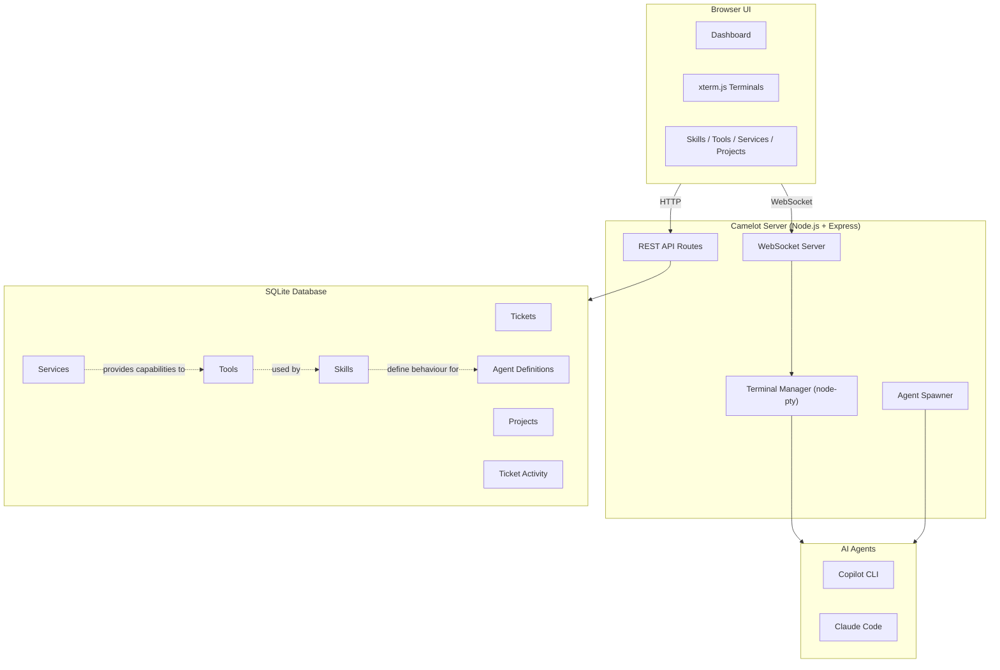

# 🏰 Camelot

AI-powered development cockpit. Multi-agent orchestration for Copilot CLI and Claude Code.

## Vision

A beautiful, interactive web dashboard that orchestrates AI coding agents on your Windows machine. Click a ticket, spawn an agent, watch it work — or jump in and take over.

## Features (Planned)

- **Multi-agent:** Copilot CLI (primary) + Claude Code (secondary) running in parallel
- **Interactive UI:** Ticket board, live agent output, hotkeys, drag/drop layouts
- **Terminal launcher:** Open Windows Terminal tabs with AI agents pre-loaded
- **In-browser terminal:** xterm.js embedded terminals (stretch goal)
- **Script runner:** Execute PowerShell scripts with live output
- **SDP integration:** Reads tickets from `.sdp/plans/`, triggers Cleanse → Plan → Attack → Review

## Stack

- **Runtime:** Node.js + TypeScript
- **Server:** Express + WebSocket
- **Database:** SQLite (better-sqlite3)
- **Terminal:** node-pty + xterm.js (stretch)
- **UI:** Modern SPA, dark theme

## Requirements

- Windows 10/11
- Node.js 20+
- [GitHub Copilot CLI](https://github.com/features/copilot/cli)
- [Claude Code](https://docs.anthropic.com/en/docs/claude-code) (optional, secondary)

## Installation

### Quick Install (Windows PowerShell)

```powershell
irm https://raw.githubusercontent.com/TechnicallyShaun/camelot/main/install.ps1 | iex
```

This downloads and installs Camelot to `~\.camelot`, installs dependencies, and starts the server.

### Manual Install

```bash
git clone https://github.com/TechnicallyShaun/camelot.git
cd camelot
npm install
npm start
```

Then open `http://localhost:1187` in your browser.

## Architecture



### Layers

| Layer | Description |
|-------|-------------|
| **Services** | External capability providers (APIs, databases, cloud services) |
| **Tools** | Connectors that wrap Services into agent-usable interfaces |
| **Skills** | Markdown instructions that define how agents use Tools |
| **Agents** | AI coding agents (Copilot CLI, Claude Code) that execute Skills |

## License

MIT
